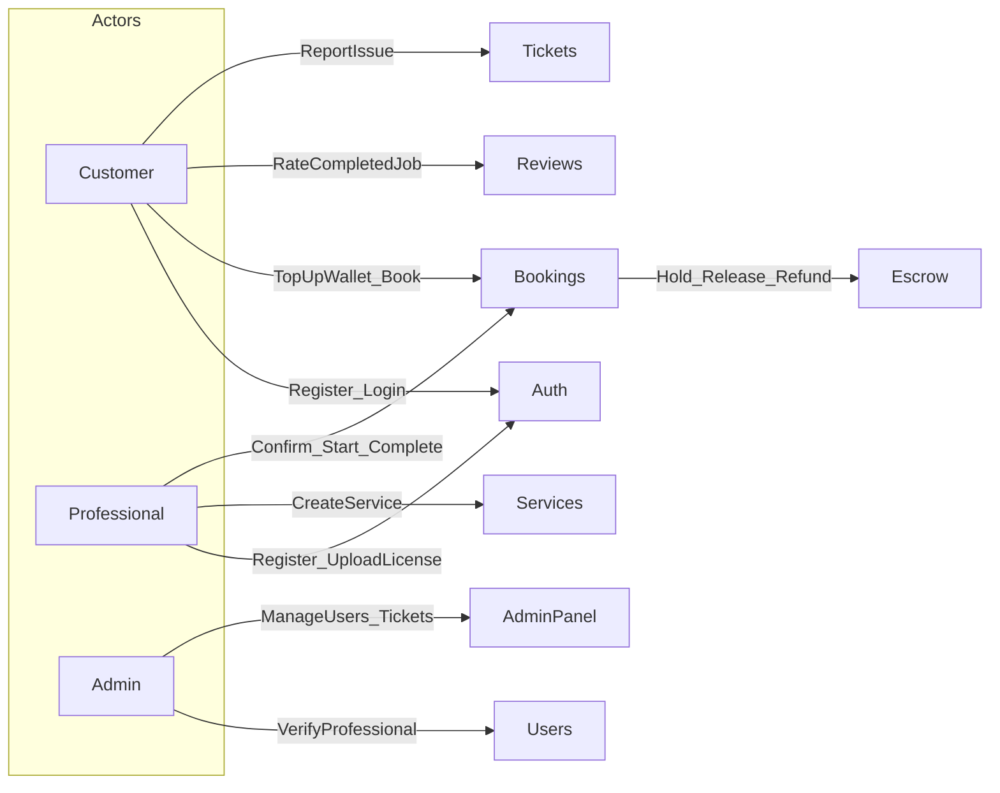

# FixHub

A Nepal-focused home services marketplace that connects customers with verified professionals for plumbing, electrical, HVAC, painting, and related work.

## Problem Statement

Homeowners in Kathmandu Valley struggle to find trustworthy technicians quickly. Informal hiring lacks verified credentials, transparent pricing, and dispute handling. FixHub addresses this with:

1. **Verified professionals** — admins review business/industrial licenses before pros can list services.
2. **Bookable services** — customers book at a scheduled time with escrow-held payment.
3. **Tracked job lifecycle** — bookings move through a controlled state machine.
4. **Trust loop** — post-job reviews update service and professional ratings.

## Decomposition of Sub-problems

| Sub-problem | Approach |
|---|---|
| Identity & roles | JWT auth; roles `customer`, `professional`, `admin`; Google OAuth optional |
| Trust & compliance | Pro uploads license → admin verifies → gate service CRUD |
| Catalog | Service listings by category with search indexes |
| Booking | State machine `pending → confirmed → in_progress → completed/cancelled` |
| Double-booking | Partial unique index on `(professionalId, scheduledAt)` for active statuses |
| Payments (simulated) | Wallet + escrow hold on book, release on complete, refund on cancel |
| Quality feedback | One review per completed booking; averages on Service & User |
| Support | Tickets linked to booking IDs |
| Engineering quality | Zod validation middleware, Winston logging, Morgan HTTP logs, Jest unit tests |

## Architecture

```
Browser (Next.js :3000)
    │  rewrite /api → Express
    ▼
Express API (:5000)
    │
    ▼
MongoDB (users, services, bookings, wallets, transactions, reviews, tickets)
```

**Layers:** Routes → Controllers → Services → Models/Repositories  
**Auth:** Bearer JWT and/or HTTP-only cookie

## Roles & Use Cases



## Status of Completeness Checklist

| Item | Status |
|---|---|
| Booking state machine | Done |
| Escrow / wallet simulation | Done |
| Review & rating loop | Done |
| Global error handler | Done (Express middleware + Winston) |
| Zod request validation middleware | Done (`validateBody`) |
| DB indexing | Done (users, services, bookings, tickets) |
| Root README / academic docs | Done (this file) |
| Env security | Done (`.env.example`, fail-fast in production) |
| Logging | Done (Morgan + Winston) |
| Jest unit tests | Done (`npm test` in backend) |

## Quick Start

### Backend

```bash
cd backend
cp .env.example .env
# set SECRET_KEY, SESSION_SECRET, MONGO_URI
npm install
npm run seed          # optional admin user
npm run dev           # http://localhost:5000
npm test              # booking + escrow unit tests
```

Default seeded admin (if using seed script): `admin@fixhub.com` / `admin123`

### Frontend

```bash
cd frontend
npm install
npm run dev           # http://localhost:3000
```

## Key API Endpoints

| Method | Path | Description |
|---|---|---|
| POST | `/api/v1/auth/register` | Register (pros may upload verification doc) |
| POST | `/api/v1/auth/login` | Login → JWT cookie |
| PATCH | `/api/v1/admin/verify-pro/:id` | Admin verifies professional |
| GET/POST | `/api/v1/services` | Browse / create services |
| GET/POST | `/api/v1/wallet` / `/topup` | Wallet balance & demo top-up |
| GET/POST | `/api/v1/bookings` | List / create bookings |
| PATCH | `/api/v1/bookings/:id/status` | `{ action: confirm\|start\|complete\|cancel }` |
| POST | `/api/v1/reviews` | Rate a completed booking |
| GET | `/api/v1/reviews/service/:serviceId` | List reviews |

## Demo Script (Presentation)

1. Register as professional → upload license → login as admin → verify pro.
2. Pro posts a service.
3. Customer tops up wallet → books service → escrow **held**.
4. Pro **confirm → start → complete** → escrow **released**.
5. Customer leaves a review → average rating updates on the service.
6. Show `npm test` and this README use-case diagram.
7. Highlight **verification flow** as the trust USP.

## Tech Stack

- **Frontend:** Next.js (App Router), React, Tailwind
- **Backend:** Express 5, TypeScript, Mongoose, Zod, Passport Google OAuth
- **DB:** MongoDB
- **Logging:** Morgan + Winston
- **Tests:** Jest + ts-jest

## License

Academic / college project — FixHub.
